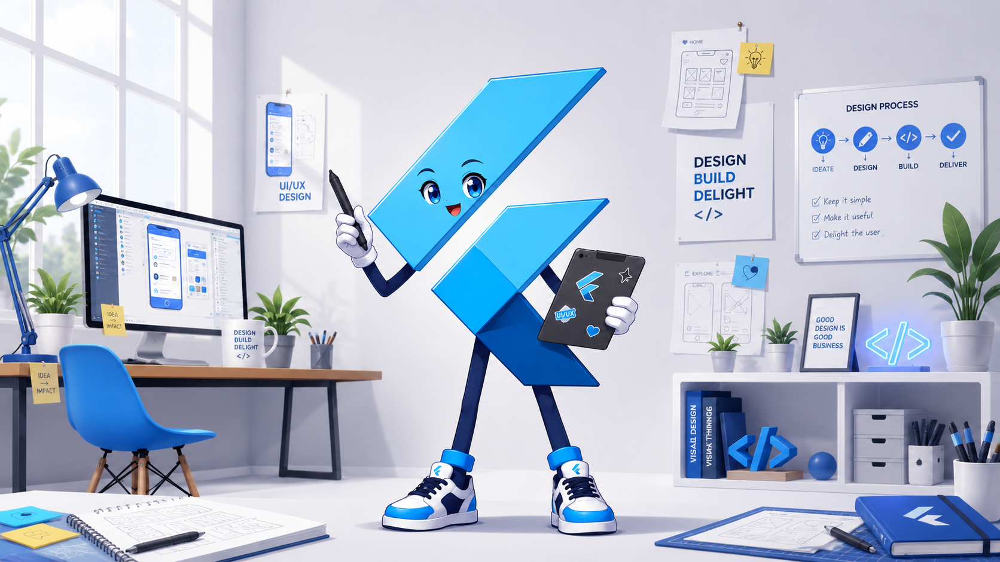
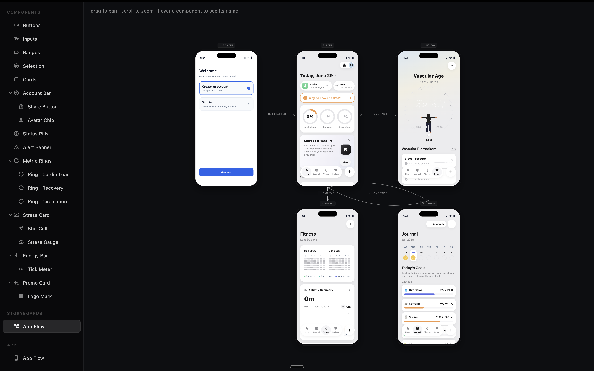

# flutter-design

<p align="center">
  
</p>

A reusable **Flutter design-system workbench** — a sidebar + canvas workbench for
building an app's UI in isolation, wiring its screens into a navigable storyboard,
and walking the real flow. Copy it to start a new app; the scaffold carries the
conventions with it.

```bash
npx degit DavidChen-006/flutter-design my-app && cd my-app
make setup
make run
```

---

## Quick start

**1. Load the scaffold** (a clean copy, no git history):

```bash
npx degit DavidChen-006/flutter-design my-app
cd my-app
```

**2. Set up, then run** — two commands:

```bash
make setup   # install dependencies + enable macOS desktop support
make run     # run the workbench on macOS
```

Prefer plain scripts over `make`? These are equivalent:

```bash
./setup.sh
./run.sh
```

> `make run` / `./run.sh` run `flutter pub get` first, so a fresh copy launches
> with a single command.

**Requirements:** the [Flutter SDK](https://docs.flutter.dev/get-started/install)
(Dart `^3.12.0`). macOS is the default run target; the project is also configured
for iOS, Android, web, Linux, and Windows.

---

## What it is

The app root (`lib/app.dart` → `LibraryShell`) is a left **sidebar + canvas**
workbench with three sections:

- **Components** — every UI component, previewed in isolation.
- **Storyboards** — each storyboard rendered as a pan/zoom graph of iPhone frames.
- **App** — walk a storyboard's flow interactively in a single frame.

<p align="center">
  
</p>

> A real snapshot of the **Storyboards** section: every screen of the app on one
> pan/zoom canvas, connected by labeled arrows (`GET STARTED`, `HOME TAB`, …) that
> show how the flow moves between screens. Drag to pan, scroll to zoom, and hover
> any component in a frame to see its name. Each frame is a live, running instance
> of your components — not a static mockup.

Two design worlds are kept strictly separate:

- **Tool chrome** — the workbench itself (`lib/dev/**`), styled with its own
  internal tokens.
- **The app** — your product (`lib/components/**`, `lib/design_system/**`,
  `lib/content/**`, `lib/features/**`). Tool styling never leaks into your
  components, and vice versa.

## AI-native — the interface is the AI

You don't build with this scaffold by clicking around. **The way you use it is by
talking to an AI agent** (e.g. Claude Code) and asking for changes — *"add a
settings screen", "make the accent color green", "connect Home → Profile"* — and
the agent writes the code. The workbench itself only *shows* your app (components,
storyboards, the live flow); **there is no button to add a component, create a
screen, or draw a storyboard edge — on purpose.** The AI makes the changes, not you.

That single AI-native authoring path is the whole point. The repo ships a
[`CLAUDE.md`](CLAUDE.md) of conventions that the agent inherits when you copy the
scaffold, and the code is structured so those edits stay safe and consistent: style
lives in one place (`lib/design_system/`), copy in another (`lib/content/`),
components are registered in a single index, and storyboards are plain data. Change
a token, a string, or a component once and it propagates to every screen and every
storyboard frame — so a small request to the agent lands everywhere it should.

## Single source of truth

```
storyboards → screens → components (style ← lib/design_system) + copy (← lib/content)
```

Storyboards and the App walker render the **same** screen objects, so every frame
is a live instance of your components. Each screen reads its **style** from design
tokens and its **copy** from the content layer — edit a token, a component, or a
string once and it changes everywhere it is used.

- `lib/design_system/` — the single source of truth for **style** (`AppColors`,
  `AppTypography`, `AppSpacing`, `AppTheme`).
- `lib/content/` — the single source of truth for **copy** (plain Dart `const`
  objects on `AppContent`; no JSON / i18n framework). Copy is always passed to a
  component as a parameter, never baked in.

## Project structure

```
lib/
├── app.dart              # LibraryShell — the workbench root
├── main.dart             # entry point
├── components/           # reusable UI components (one public widget per file)
├── design_system/        # design tokens — single source of truth for style
├── content/              # user-facing copy — single source of truth for text
├── features/             # screens, composed only from components/
└── dev/                  # the workbench tool itself
    ├── library/          # sidebar + canvas shell and theming
    ├── sections/         # Components / Storyboards / App section views
    └── storyboard/       # Board / StoryNode / StoryEdge models + canvas
```

## Working in the scaffold

- **Add a component** — create `lib/components/<name>.dart` (token-driven, with
  every tap target wrapped in `Pressable`) and register it in
  `lib/dev/sections/components_section.dart`. Decompose composites down to their
  interactive leaves and list them as `children` so the sidebar shows the tree.
- **Add a screen** — create `lib/features/<flow>/<screen>.dart`, composed only
  from `lib/components/`, reading style from `lib/design_system/` and copy from
  `lib/content/`.
- **Add copy** — add a `final String` to the screen's content class in
  `lib/content/`, then reference it as `AppContent.<feature>.<field>`.
- **Shape a storyboard** — edit `kBoards` in `lib/dev/storyboard/storyboards.dart`:
  add `StoryNode`s with positions and connect them with labeled `StoryEdge`s.
  Prefer one board holding every screen, so it reads as a live map of the whole
  app. Flows may branch and cycle — they are not forced linear.

> Keep the base generic. App-specific screens, components, and palettes belong in
> the app repo that copies this one — only reusable scaffold features belong here.

See [`CLAUDE.md`](CLAUDE.md) for the full conventions inherited at copy-time.
